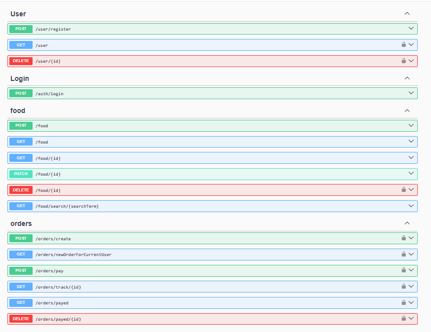

# Projet Restaurant avec Nest.js, PostgreSQL et Angular
L'objectif de ce projet était de créer un restaurant de kebab en ligne, permettant aux utilisateurs de passer des commandes facilement.

## Installation

Pour installer les dépendances, suivez les étapes ci-dessous :

### Backend (Nest.js)

Exécutez la commande suivante pour installer les dépendances du backend :

```
npm install
```


Démarrez le serveur Nest.js :

```
npm run start:dev
```

REST API

<div id="" align="center">
 
</div>

Accédez au Swagger API  : http://localhost:3000/api

Frontend (Angular)
Installez les dépendances du frontend en exécutant la commande :

```
npm install
```

Lancez le serveur  :
```
ng serve
```

exécuter les tests du frontend :
```
ng test

```
## Dépendances

Ce projet utilise les technologies suivantes :

- Nest.js
- Angular
- PostgreSQL
- TypeScript

